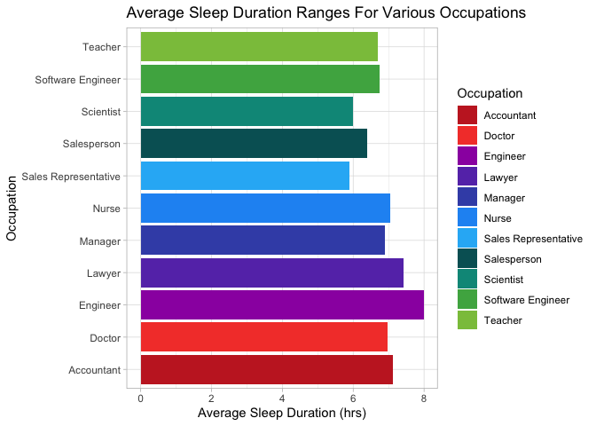
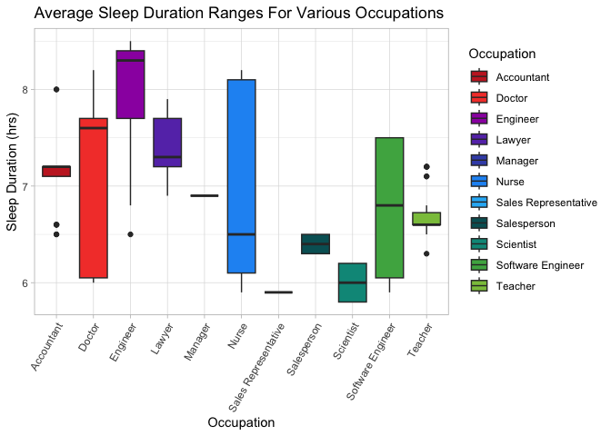

#Install Library 

```r
#install.packages("tidyverse")
#install.packages("janitor")
```


#Load Library

```r
library(tidyverse)
```

```
## Warning: package 'tidyverse' was built under R version 4.2.3
```

```
## Warning: package 'ggplot2' was built under R version 4.2.3
```

```
## Warning: package 'tibble' was built under R version 4.2.3
```

```
## Warning: package 'tidyr' was built under R version 4.2.3
```

```
## Warning: package 'readr' was built under R version 4.2.3
```

```
## Warning: package 'purrr' was built under R version 4.2.3
```

```
## Warning: package 'dplyr' was built under R version 4.2.3
```

```
## Warning: package 'stringr' was built under R version 4.2.3
```

```
## Warning: package 'forcats' was built under R version 4.2.3
```

```
## Warning: package 'lubridate' was built under R version 4.2.3
```

```
## ── Attaching core tidyverse packages ──────────────────────── tidyverse 2.0.0 ──
## ✔ dplyr     1.1.3     ✔ readr     2.1.4
## ✔ forcats   1.0.0     ✔ stringr   1.5.0
## ✔ ggplot2   3.4.3     ✔ tibble    3.2.1
## ✔ lubridate 1.9.2     ✔ tidyr     1.3.0
## ✔ purrr     1.0.2     
## ── Conflicts ────────────────────────────────────────── tidyverse_conflicts() ──
## ✖ dplyr::filter() masks stats::filter()
## ✖ dplyr::lag()    masks stats::lag()
## ℹ Use the conflicted package (<http://conflicted.r-lib.org/>) to force all conflicts to become errors
```

```r
library(janitor)
```

```
## Warning: package 'janitor' was built under R version 4.2.3
```

```
## 
## Attaching package: 'janitor'
## 
## The following objects are masked from 'package:stats':
## 
##     chisq.test, fisher.test
```

```r
library(paletteer)
```

```
## Warning: package 'paletteer' was built under R version 4.2.3
```

```r
library(ggthemes)
```

```
## Warning: package 'ggthemes' was built under R version 4.2.3
```


#Import Data

```r
health_data <- read_csv("ss.csv")
```

```
## Rows: 373 Columns: 13
## ── Column specification ────────────────────────────────────────────────────────
## Delimiter: ","
## chr (5): Gender, Occupation, BMI Category, Blood Pressure, Sleep Disorder
## dbl (8): Person ID, Age, Sleep Duration, Quality of Sleep, Physical Activity...
## 
## ℹ Use `spec()` to retrieve the full column specification for this data.
## ℹ Specify the column types or set `show_col_types = FALSE` to quiet this message.
```

```r
health_data <- clean_names(health_data)
```

```r
colors <- paletteer::palettes_d_names
```


```r
my_palette <- paletteer_d("awtools::bpalette")
```

#Effects of occupation on sleep duration

```r
health_data %>% 
  group_by(occupation) %>% 
  summarize(average_sleep_duration=mean(sleep_duration)) %>% 
  ggplot(aes(x=occupation, y=average_sleep_duration, fill=occupation))+
  geom_col()+
  scale_fill_manual(values=my_palette)+
  theme_classic()+
  coord_flip()+
  labs(title="Average Sleep Duration For Various Occupations")
```

<!-- -->


```r
health_data %>% 
  ggplot(aes(x=occupation, y=sleep_duration, fill=occupation))+
  geom_boxplot()+
  scale_fill_manual(values=my_palette)+
  theme_classic()+
  labs(title="Average Sleep Duration Ranges For Various Occupations")+
  theme(axis.text.x=element_text(angle=60,hjust=1))
```

<!-- -->
#Count

```r
health_data %>% 
  count(occupation, sort=T)
```

```
## # A tibble: 11 × 2
##    occupation               n
##    <chr>                <int>
##  1 Nurse                   72
##  2 Doctor                  71
##  3 Engineer                63
##  4 Lawyer                  47
##  5 Teacher                 40
##  6 Accountant              37
##  7 Salesperson             32
##  8 Scientist                4
##  9 Software Engineer        4
## 10 Sales Representative     2
## 11 Manager                  1
```

