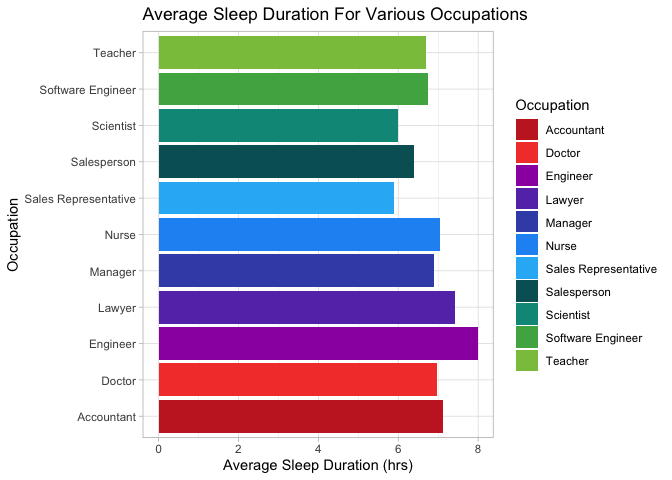
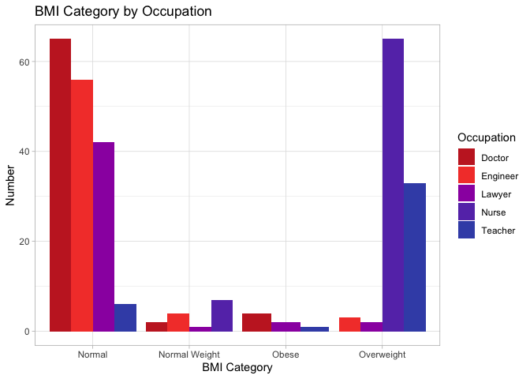

#Install Library 

```r
#install.packages("here")
#install.packages("tidyverse")
#install.packages("janitor")
```


#Load Library

```r
library(tidyverse)
```

```
## ── Attaching core tidyverse packages ──────────────────────── tidyverse 2.0.0 ──
## ✔ dplyr     1.1.4     ✔ readr     2.1.4
## ✔ forcats   1.0.0     ✔ stringr   1.5.1
## ✔ ggplot2   3.4.4     ✔ tibble    3.2.1
## ✔ lubridate 1.9.3     ✔ tidyr     1.3.0
## ✔ purrr     1.0.2     
## ── Conflicts ────────────────────────────────────────── tidyverse_conflicts() ──
## ✖ dplyr::filter() masks stats::filter()
## ✖ dplyr::lag()    masks stats::lag()
## ℹ Use the conflicted package (<http://conflicted.r-lib.org/>) to force all conflicts to become errors
```

```r
library(janitor)
```

```
## 
## Attaching package: 'janitor'
## 
## The following objects are masked from 'package:stats':
## 
##     chisq.test, fisher.test
```

```r
library(paletteer)
library(ggthemes)
```

```
## Warning: package 'ggthemes' was built under R version 4.3.2
```

```r
library(here)
```

```
## here() starts at /Users/memontal/Desktop/BIS15W2024_group9
```


#Import Data

```r
health_data <- read_csv(here("data/ss.csv"))
```

```
## Rows: 373 Columns: 13
## ── Column specification ────────────────────────────────────────────────────────
## Delimiter: ","
## chr (5): Gender, Occupation, BMI Category, Blood Pressure, Sleep Disorder
## dbl (8): Person ID, Age, Sleep Duration, Quality of Sleep, Physical Activity...
## 
## ℹ Use `spec()` to retrieve the full column specification for this data.
## ℹ Specify the column types or set `show_col_types = FALSE` to quiet this message.
```

```r
health_data <- clean_names(health_data)
```

```r
colors <- paletteer::palettes_d_names
```


```r
my_palette <- paletteer_d("awtools::bpalette")
```

#Effects of occupation on sleep duration

```r
health_data %>% 
  group_by(occupation) %>% 
  summarize(average_sleep_duration=mean(sleep_duration)) %>% 
  ggplot(aes(x=occupation, y=average_sleep_duration, fill=occupation))+
  geom_col()+
  scale_fill_manual(values=my_palette)+
  theme_light()+
  coord_flip()+
  labs(title="Average Sleep Duration Ranges For Various Occupations",
       x="Occupation", 
       y="Average Sleep Duration (hrs)", 
       fill="Occupation")
```

<!-- -->


```r
health_data %>% 
  ggplot(aes(x=occupation, y=sleep_duration, fill=occupation))+
  geom_boxplot()+
  scale_fill_manual(values=my_palette)+
  theme_light()+
  labs(title="Average Sleep Duration Ranges For Various Occupations",
       x="Occupation", 
       y="Sleep Duration (hrs)", 
       fill="Occupation")+
  theme(axis.text.x=element_text(angle=60,hjust=1))
```

<!-- -->
#Count

```r
health_data %>% 
  count(occupation, sort=T)
```

```
## # A tibble: 11 × 2
##    occupation               n
##    <chr>                <int>
##  1 Nurse                   72
##  2 Doctor                  71
##  3 Engineer                63
##  4 Lawyer                  47
##  5 Teacher                 40
##  6 Accountant              37
##  7 Salesperson             32
##  8 Scientist                4
##  9 Software Engineer        4
## 10 Sales Representative     2
## 11 Manager                  1
```

# Top 5 occupations in dataset


```r
selected_data <- health_data %>% 
  filter(occupation=="Nurse"| occupation=="Doctor"| occupation=="Engineer"| occupation=="Lawyer"| occupation=="Teacher")
selected_data
```

```
## # A tibble: 293 × 13
##    person_id gender   age occupation sleep_duration quality_of_sleep
##        <dbl> <chr>  <dbl> <chr>               <dbl>            <dbl>
##  1         2 Male      28 Doctor                6.2                6
##  2         3 Male      28 Doctor                6.2                6
##  3         7 Male      29 Teacher               6.3                6
##  4         8 Male      29 Doctor                7.8                7
##  5         9 Male      29 Doctor                7.8                7
##  6        10 Male      29 Doctor                7.8                7
##  7        11 Male      29 Doctor                6.1                6
##  8        12 Male      29 Doctor                7.8                7
##  9        13 Male      29 Doctor                6.1                6
## 10        14 Male      29 Doctor                6                  6
## # ℹ 283 more rows
## # ℹ 7 more variables: physical_activity_level <dbl>, stress_level <dbl>,
## #   bmi_category <chr>, blood_pressure <chr>, heart_rate <dbl>,
## #   daily_steps <dbl>, sleep_disorder <chr>
```

# Age range in data

```r
selected_data %>% 
  ggplot(aes(x=occupation, y=age, fill=occupation))+
  geom_boxplot()+
  scale_fill_manual(values=my_palette)+
  theme_light()+
  labs(title="Age Range of data in Various Occupations",
       x="Occupation", 
       y="Age", 
       fill="Occupation")+
  theme(axis.text.x=element_text(angle=60,hjust=1))
```

<!-- -->


# Sleep duration vs quality of sleep 

```r
selected_data %>% 
  ggplot(aes(x=sleep_duration, y=quality_of_sleep, fill=occupation))+
  geom_col()+
  facet_wrap(~occupation)+
  scale_fill_manual(values=my_palette)+
  theme_light()+
  labs(title="Sleep Duration VS Quality of Sleep")
```

<!-- -->

# Stress Levels based on occupation 

```r
selected_data %>% 
  ggplot(aes(x=stress_level, fill=occupation))+
  geom_bar()+
  facet_wrap(~occupation)+
  scale_fill_manual(values=my_palette)+
  theme_light()+
  labs(title="Stress Levels for Each Occupation")
```

<!-- -->

# BMI category by occupation

```r
selected_data %>% 
  ggplot(aes(x=bmi_category, fill= occupation))+
  geom_bar(position = "dodge")+
  theme_light()+
  scale_fill_manual(values=my_palette)+
  labs(title="BMI Category by Occupation",
       x="BMI Category", 
       y="Number",
       fill="Occupation")
```

<!-- -->
# Sleep disorders present in occupations?

```r
selected_data %>% 
  ggplot(aes(x=sleep_disorder, fill= occupation))+
  geom_bar(position = "dodge")+
  theme_light()+
  scale_fill_manual(values=my_palette)+
  labs(title="Sleep Disorders in Occupations",
       x="Sleep Disorder", 
       y="Number",
       fill="Occupation")
```

<!-- -->

